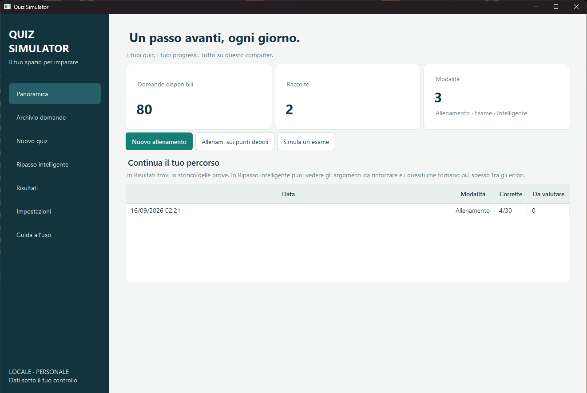

<div align="center">

# Quiz Simulator

Applicazione desktop per Windows per creare, importare e ripassare raccolte di quiz con storico degli errori e allenamento adattivo.

[](https://github.com/t0shiro94/quiz-simulator/releases/tag/v1.0.0)


[](LICENSE)

**[⬇️ Scarica Quiz Simulator per Windows](https://github.com/t0shiro94/quiz-simulator/releases/latest)**  
[Guida utente](GUIDA_UTENTE.md) · [Architettura](ARCHITECTURE.md) · [Changelog](CHANGELOG.md) · [Contribuire](CONTRIBUTING.md) · [Sicurezza](SECURITY.md)

</div>

---

Ho creato Quiz Simulator per organizzare le mie raccolte di domande e rendere più efficace il ripasso. È un'applicazione desktop per Windows che importa file JSON e PDF, propone allenamenti ed esami, conserva gli errori e costruisce ripassi mirati in base ai risultati.

L'applicazione funziona in locale: archivio, cronologia e fonti importate restano nella cartella del programma. Per chiedere un approfondimento a ChatGPT viene usato un passaggio esplicito tramite il browser e non servono chiavi API.



## Funzioni principali

- domande a scelta singola e scelta multipla;
- risposte aperte brevi con correzione automatica per varianti ammesse;
- risposte aperte libere con risposta modello, criteri e autovalutazione;
- importazione JSON v2 e compatibilità con il formato v1;
- importazione assistita di PDF testuali con anteprima e correzione;
- modalità Allenamento, Esame e Allenamento intelligente;
- memoria degli errori, analisi per argomento e ripassi programmati;
- ricerca indicizzata, filtri, preferiti e modifica delle domande;
- aggiornamento o sostituzione completa delle raccolte;
- cestino recuperabile per domande, raccolte e prove;
- esportazione JSON e backup ZIP verificato prima del ripristino;
- spiegazioni e annotazioni personali associate alla versione della domanda.

La [guida utente](GUIDA_UTENTE.md) descrive ogni schermata e contiene i formati completi per preparare JSON e PDF importabili.

## Avvio rapido

### Pacchetto Windows già compilato

Scaricare `QuizSimulator-Windows.zip` dall'[ultima release](https://github.com/t0shiro94/quiz-simulator/releases/latest), estrarre l'intera cartella e avviare `QuizSimulator.exe`. Se si usa una copia del progetto che contiene già la cartella `dist`, è disponibile anche `Avvia Quiz Simulator.cmd`.

Non spostare soltanto l'eseguibile: la distribuzione `onedir` usa anche i file che si trovano accanto ad esso. I dati vengono creati nella cartella del programma, quindi occorre avviarlo da una posizione in cui l'utente abbia il permesso di scrittura.

### Avvio dal codice sorgente

Servono Windows 10 o 11, PowerShell e Python 3.14.

Clonare o scaricare il repository, quindi aprire PowerShell nella sua cartella:

```powershell
Set-ExecutionPolicy -Scope Process Bypass
.\scripts\setup.ps1
& '.\Avvia Quiz Simulator.cmd'
```

Il clone può essere avviato anche direttamente:

```powershell
.\.venv\Scripts\python.exe run_quiz.py
```

Lo script di configurazione crea `.venv` e installa le versioni delle dipendenze fissate in `requirements-dev.txt`.

## Primo utilizzo

Alla prima apertura, nella Panoramica scegliere **Prova la raccolta di esempio**. Dopo il controllo dell'anteprima, confermare l'importazione e avviare un allenamento.

Per utilizzare materiale proprio:

1. aprire **Archivio domande**;
2. scegliere **Importa JSON o PDF**;
3. controllare le domande riconosciute e assegnare gli argomenti;
4. selezionare **Crea**, **Aggiorna** o **Sostituisci**;
5. confermare il riepilogo prima di modificare l'archivio.

Nella cartella `examples` sono presenti raccolte separate per tutti e quattro i tipi di domanda, oltre a due PDF importabili. Lo schema formale del formato corrente si trova in `schemas/quiz-v2.schema.json`.

## Sviluppo e test

Installare prima l'ambiente di sviluppo con `scripts/setup.ps1`, quindi eseguire:

```powershell
.\.venv\Scripts\python.exe -m pytest
```

I test coprono valutazione, importazione, persistenza, backup, statistiche e percorsi principali dell'interfaccia. Per una verifica rapida dell'avvio:

```powershell
.\.venv\Scripts\python.exe run_quiz.py --smoke-test
```

Il risultato dello smoke test viene scritto sotto `tmp/smoke-test` e non usa l'archivio personale.

Il controllo di stile e la prova di scala si eseguono con:

```powershell
.\.venv\Scripts\ruff.exe check quiz_simulator tests scripts run_quiz.py
.\.venv\Scripts\ruff.exe format --check quiz_simulator tests scripts run_quiz.py
.\.venv\Scripts\python.exe scripts\benchmark.py
```

Il benchmark usa un archivio temporaneo dentro `tmp`, genera 50.000 domande e 500.000 tentativi, verifica ricerca, statistiche, Panoramica e selezione adattiva, quindi elimina il database di prova. L'ultimo resoconto rimane in `tmp/benchmark-last.json`.

Per rigenerare gli esempi documentati:

```powershell
.\.venv\Scripts\python.exe scripts\create_examples.py
```

## Creazione dell'eseguibile

```powershell
.\scripts\build.ps1
```

La distribuzione viene creata in `dist/QuizSimulator` e il pacchetto pronto da condividere in `dist/QuizSimulator-Windows.zip`. Il comando esegue prima controlli e test, poi include guida, licenza, esempi e schema JSON. Prima di pubblicarla conviene provarla su un account Windows che non abbia Python installato e mantenere insieme tutti i file della cartella generata.

## Organizzazione del progetto

```text
quiz_simulator/    interfaccia, dominio, importazione e persistenza
tests/             test automatici del dominio, archivio e interfaccia
examples/          JSON e PDF pronti per l'importazione
docs/              immagine dell'interfaccia usata nella documentazione
schemas/           schema JSON della versione corrente
scripts/           configurazione, esempi, controllo visivo e build
```

I dati creati durante l'uso (`data`, `backups` e `tmp`) sono esclusi dal versionamento. Il database SQLite contiene le raccolte, le revisioni, le prove e gli indicatori di apprendimento; le fonti importate vengono conservate in `data/sources`.

## Contribuire e sicurezza

Le indicazioni per proporre modifiche sono in [CONTRIBUTING.md](CONTRIBUTING.md). Per segnalazioni che riguardano file malevoli, perdita di dati o accesso non previsto all'archivio, consultare [SECURITY.md](SECURITY.md).

## Licenza

Il progetto è sviluppato e mantenuto da [Raffaele (@t0shiro94)](https://github.com/t0shiro94) ed è distribuito con licenza [MIT](LICENSE).
